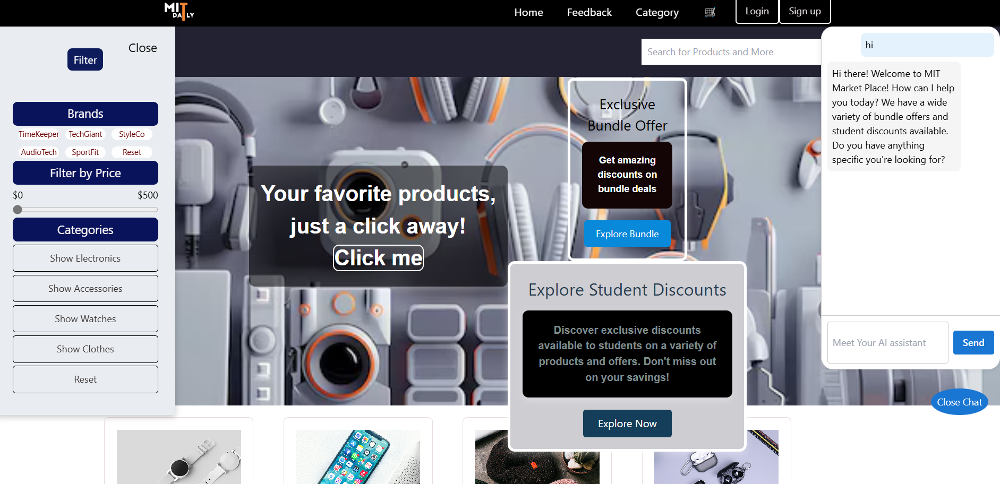
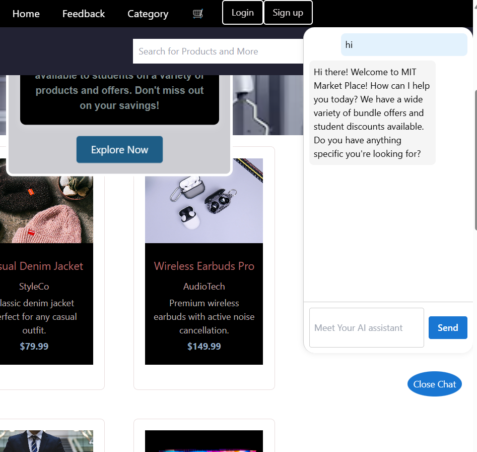
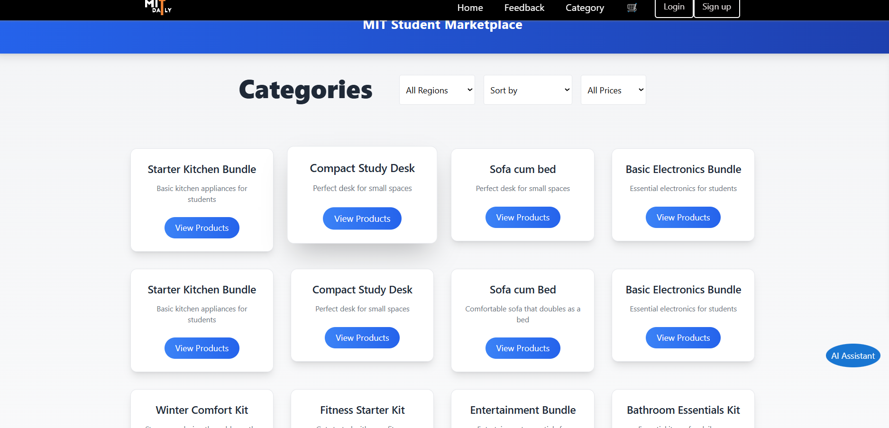
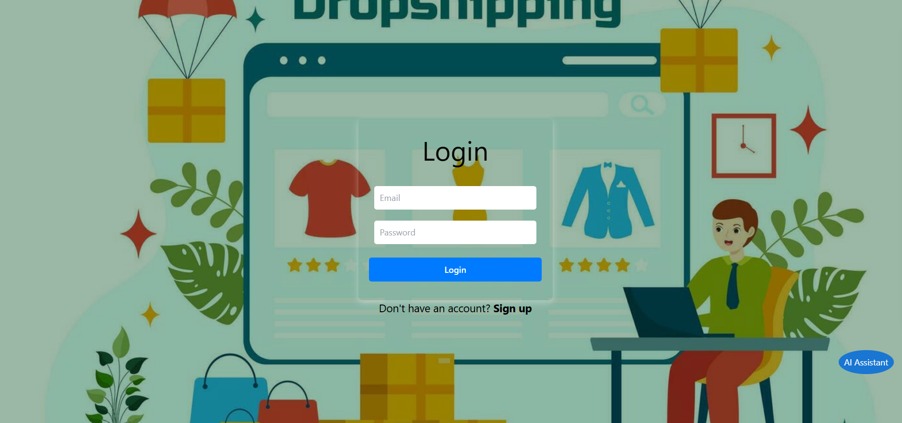
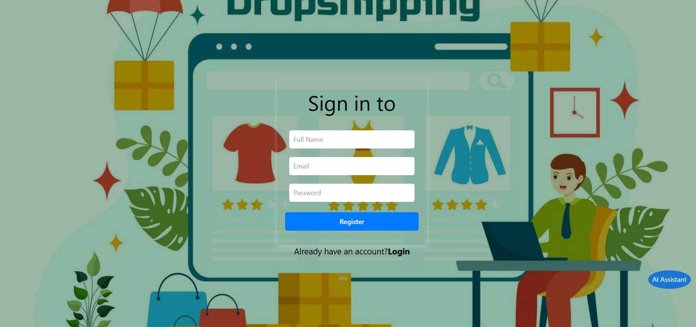
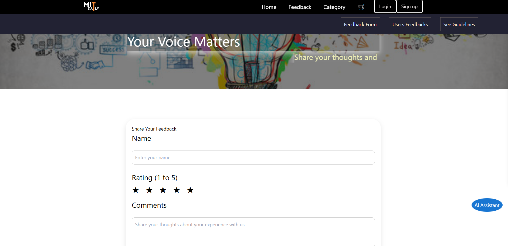
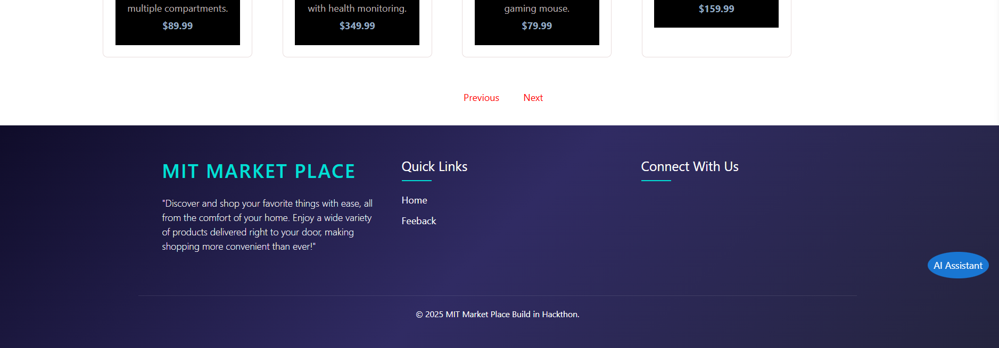

<h2>Project Name ----> MIT Daily</h2>
<h2>Tech Stack ----> Node, React, Firebase , Express , tailwind ,cs , axios , mongoDb</h2>
<h2>Node version ----> 22.12.0</h2>
<h2>React version ----> 18.3.1</h2>
 
 
<h3>Description</h3>
<h2>Welcome to MIT Daily – the premier e-commerce platform designed to connect students, faculty, and the broader community with  high-quality products and innovative features. Our mission is to create a seamless and engaging shopping experience tailored  to the unique needs of the MIT community and beyond.</h2>

<h3>Team Member : </h3>
 <h3>Sheikh Faizan </h3>
 <h3>Sakshi </h3>
 <h3>Sunny Mourya : </h3>
 
 

 
<h2>Main Section of Home Page</h2>
<h4>this is the main page of MIT daily </h4>

 
 

<h2>Ai chat</h2>
<h4>You can chat with Ai and ask questions to get more clearity</h4>

 
 

<h2>categories section</h2>
<h4>here you can filter you choice and choose your best package </h4>

 
 

<h2>Login Page</h2>
<h4>Login</h4>

 
 

<h2>SignUp Page</h2>
<h4>SignUp</h4>

 
 

<h2>Community Page</h2>
<h4>Give us your valuable feedback from this page and communicate with others</h4>

 
 
<h2>Footer</h2>
<h4>Let Us know if you are facing any issue using this page</h4>

 
 

